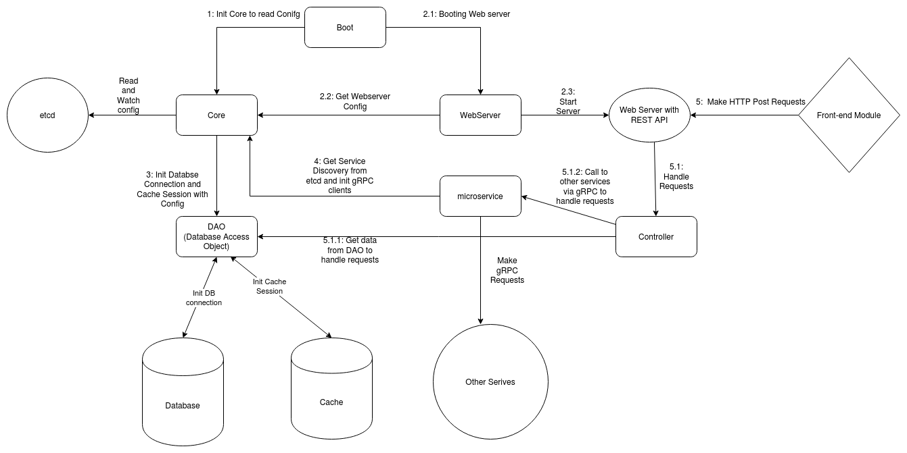
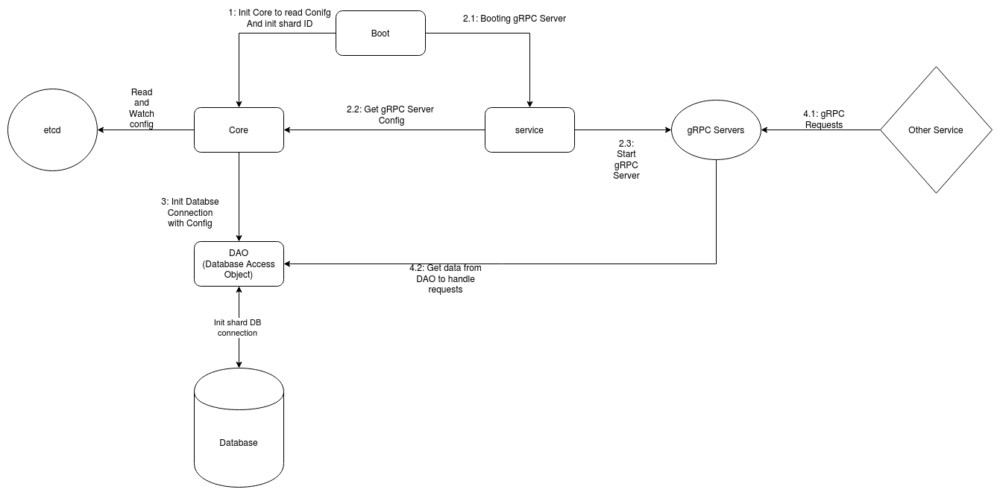

# Tài liệu phát triển phần mềm
## 1. Xác định yêu cầu
### 1.1 Biểu đồ UseCase
#### 1.1.1 Xác định Actor
Hệ thống gồm 3 actor chính:
- Actor thủ thư: Là người quản lý sách và thông tin mượn trả
- Actor sinh viên : Là độc giả, theo dõi thông tin trên trang web
- Actor Admin : Là người quản trị hệ thống
#### 1.1.2 Biểu đồ Usecase tổng quan

#### 1.1.3 Biểu đồ Usecase chi tiết
- UseCase chi tiết của Thủ thư 

- UseCase chi tiết của Sinh Viên

- UseCase chi tiết của Admin 

### 1.2 Đặc tả chi tiết Usecase:
- [Tại đây](https://drive.google.com/file/d/1E4QsfgcYECWx2HlTyU-J6KisU6yErmQ3/view?usp=sharing)
### 1.2 Biểu đồ cộng tác (frontend view)
- Biểu đồ cộng tác cho chức năng tạo phiếu mượn sách

- Biểu đồ cộng tác cho chức năng trả sách và thanh toán phụ phí (nếu có)

- Biểu đồ cộng tác cho chức năng thống kê

- Biểu đồ cộng tác cho chức năng theo dõi sách đang mượn

### 1.3 Biểu đồ ER

## 2. Thiết kế  hệ thống:

### 2.1 System Overall:

Trên đây là thiết kế  tổng quan của hệ thống. Hệ thống được thiết kế  theo kiến trúc microservices. Hệ thống gồm các components chính sau:

+ etcd: phục vụ việc lưu config của các service, đồng thời đóng vai trò trong việc service discovery trong hệ thống.
+ Front-end module: là front-end của hệ thống.
+ Portal: service đóng vai trò authenticate đăng nhập của các users, đồng thời cũng có access đến cache của hệ thống để trả ra data trong cache trước khi make request xuống các service khác. Portal còn có nhiệm vụ như một load-balancer trong việc sharding.
+ UserDB: database của user.
+ Cache: multidimension cache của hệ thống, hiện đang sử dụng cassanrdra.
+ Các docmanager được shard: gồm các service docmanager được sharding từ 0,1,2,... n. Là các service có nhiệm vụ quản lý documents. 
+ DocDB-Shards: Đây là databases của các service docmanagers nói trên.

Có 2 communication protocol được sử dụng trong hệ thống:
+ HTTP protocol: giao tiếp giữa portal và front-end module.
+ gRPC: giao tiếp giữa các service trong hệ thống với nhau.

Dưới đây sẽ nói kĩ về  thiết kế  package service portal và các service docmanagers.

### 2.2 portal:

Portal bao gồm các package sau: boot, core, webserver, microservice và DAO.

Như trên hình, hệ thống sẽ được boot bởi package boot. Quy trình như sau:

+ 1: boot sẽ init package core, để core đọc config của service từ etcd, thực hiện service discovery để tìm các service khác, đồng thời chạy 1 daemon để liên tục watch config change từ etcd.
+ 2: boot sẽ bắt đầu boot webserver (2.1). package webserver sẽ đọc config của webserver từ core (2.2). Sau khi lấy được config, webserver sẽ start 1 http server ở port 11000 (2.3).
+ 3: core sẽ đọc config từ etcd, cùng package DAO thực hiện init connection đến database và init session đến cache.
+ 4: package microservice sẽ sử dụng thông tin service discovery lấy được từ core để  init connection đến các service trong hệ thống.

Sau đó, 1 request từ người dùng sẽ được thực hiện như sau:
+ 5.0: Người dùng tương tác trên front-end, sau đó front-end tạo HTTP request đến WebServer dựa trên các API server cung cấp.
+ 5.1: Request được chuyển đến package controller để  parse và xử lý, từ đây, controller sẽ:
    + 5.1.1: xử lý và gọi đến DAO nếu cần thiết.
    + 5.1.2: xử lý và gọi đến microservice để tạo gRPC requests đến các services khác nếu cần thiết.
+ 5.2: Sau đó trả về  response cho Front-end module.

### 2.3 docmanager:

Docmanager service bao gồm các package sau: boot, core, service, DAO.

Như trên hình, hệ thống sẽ được boot bởi package boot. Quy trình như sau:

+ 1: boot sẽ init package core, init shard id, core đọc config của service từ etcd, đồng thời chạy 1 daemon để liên tục watch config change từ etcd.
+ 2: boot sẽ bắt đầu boot package service (2.1). package service sẽ đọc config của gRPC server từ core (2.2). Sau khi lấy được config, service sẽ start 1 gRPC server ở port = 10000 + shard id (10000 nếu shard id = 0, 10001 nếu shard id = 1, ...), đồng thời register với etcd về service của mình (2.3).
+ 3: core sẽ đọc config từ etcd, cùng package DAO thực hiện init connection đến database và init session đến cache.

Một gRPC request được xử  lý như sau:
+ 4.1: Service ngoài make gRPC request vào gRPC server. 
+ 4.2: gRPC với các method được define sẵn sẽ xử lý request, gọi đến DAO để lấy data từ database nếu cần thiết. Sau đó trả về response.

### 2.4 Các side-package dùng trong hệ thống để hỗ trợ các service:
#### etcdConfig: 
+ Bao gồm 1 script python để push config hệ thống lên etcd, và file json chứa config hệ thống.
#### skeleton:
+ Bao gồm các hàm, struct và thư viện dùng chung giữa các service, file proto và protobuf được generate ra phục vụ gPRC communication protocol cũng được đặt ở đây.

### Điểm mạnh và điểm yếu của system:
#### 1) Điểm mạnh:
- Hệ thống được thiết kế bằng kiến trúc microservices, quá đó đảm bảo phần nào High Availability(AV) và có thể  load balancing giữa các service. Việc scale hệ thống theo chiều ngang là có thể.
- Các service được thiết kế theo 2 dessign partern chính là Abstract Factory và Chain of Responsibility. Các package được chia theo logical purpose, qua đó việc thay đổi code hay công nghệ ở các package tương đối đơn giản.
#### 2) Điểm yếu: 
- Xử dụng microservice khiến cho việc deploy hệ thống tương đối phức tạp. Đồng thời code base cũng khá lớn, dẫn đến việc phải code tương đối nhiều và kĩ. Việc xử lý requests sẽ bị tăng thêm chút overhead do communication delay.
- Việc testing sẽ phức tạp hơn, nhất là intergration test giữa các services.