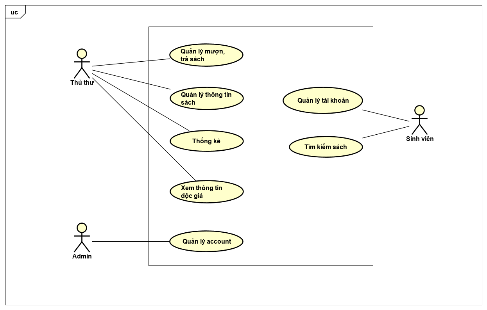
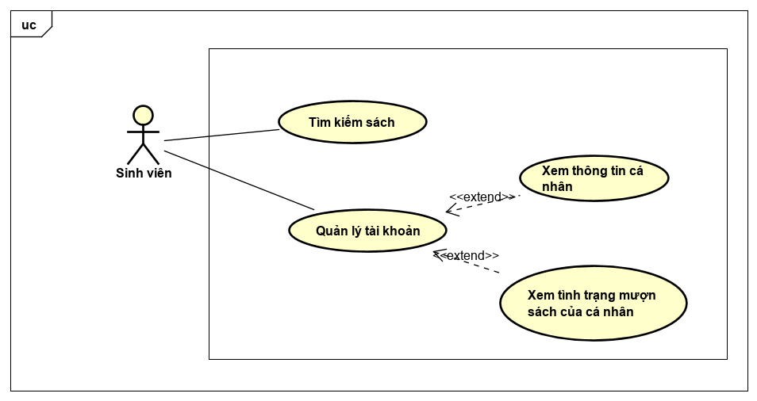

# Tài liệu phát triển phần mềm
## 1. Xác định yêu cầu
### 1.1 Biểu đồ UseCase
#### 1.1.1 Xác định Actor
Hệ thống gồm 3 actor chính:
- Actor thủ thư: Là người quản lý sách và thông tin mượn trả
- Actor sinh viên : Là độc giả, theo dõi thông tin trên trang web
- Actor Admin : Là người quản trị hệ thống
#### 1.1.2 Biểu đồ Usecase tổng quan

#### 1.1.3 Biểu đồ Usecase chi tiết
- UseCase chi tiết của Thủ thư

- UseCase chi tiết của Sinh Viên

- UseCase chi tiết của Admin 

### 1.2 Đặc tả chi tiết Usecase:
- [Tại đây](https://drive.google.com/file/d/1E4QsfgcYECWx2HlTyU-J6KisU6yErmQ3/view?usp=sharing)
